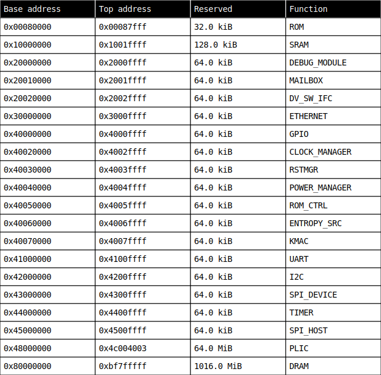

# Architecture

The Mocha architecture contains two crossbars.
One crossbar is 64-bit width and is meant for the main memory.
The other crossbar is uncached and meant to contain the peripherals.
Because most of these peripherals are imported from OpenTitan, in the first instance this bus is implemented as a TileLink Ultra-Lightweight bus with 32-bit width.

## Clock domains

There are three clock domains in Mocha.

1. Main: The main clock domain is the high-speed clock domain that runs the CVA6 core as well as the AXI crossbar it connects to, the AXI tag controller, debug module and the SRAM.
2. IO: The IO clock drives most of the peripherals and runs at a lower speed than the main clock.
   It drives the TileLink bus and most of the peripherals that are connected to it like the UART and the SPI device.
3. AON: The always on clock is also a low-speed clock with the difference being that it is always on.
   Both the main and IO clocks can be disabled and are turned off when a system reset is requested.
   The always on clock drives the clock, reset and power managers and allows the system to come out of reset.

## Memory map

This is the current memory map for Mocha, where the base and top addresses are inclusive, and reserved is the amount of memory reserved for this function:

## Top-level interface

The Mocha top will need a few top-level inputs.
Some of these are listed here:
- Clock outputs from PLLs.
- Rollback counter backed by OTP.
- Debug and design for test enable pins.
- True random noise source to drive the entropy source.
- AXI subordinate port to connect to the mailbox.

In terms of output, the top-level will need output signals:
- Key to provide an AES engine outside of the secure enclave with the memory encryption key.
- AXI manager port to interact with the rest of the chip.

